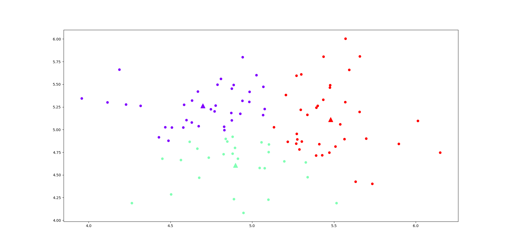

# KmeansPlusPlus
### Introduction
This is an implementation of the popular clustering algorithm K-Means++. K-Means is a popular clustering algorithm used for partitioning a dataset into distinct groups, called clusters. The algorithm's effectiveness often depends on the initial placement of cluster centroids. Traditional K-Means starts with randomly selected centroids, which may result in suboptimal convergence.

K-Means++ addresses this limitation by employing a smarter initialization strategy. Instead of randomly selecting the first centroid, K-Means++ chooses it with a higher probability based on the distance from data points. Subsequent centroids are chosen with a similar approach, emphasizing points farther from existing centroids.

### Input for my program
The algorithm only works for two dimensional points. You can check the format of the input file in the uploaded examples(normal.txt and unbalanced.txt).

### How to run my code
First you would need to have a python environment with the packages numpy and matplotlip installed in it.  
The python script should be run with the proper arguments.  
```python kmeans++.py <path_to_file> <k_clusters> <number_of_restarts>```  
The last argument being optional, where the default value is 0 if not added.  
Example:  
```python kmeans++.py normal/normal.txt 3```  
Output:  


### License 
This project is licensed under the MIT License - see the LICENSE file for details.

Thank you for checking out my K-Means++ clustering algorithm!